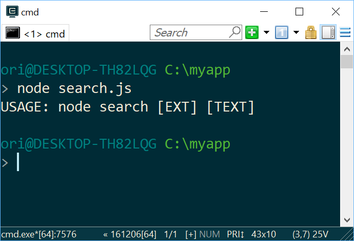
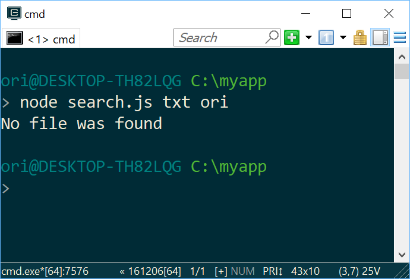
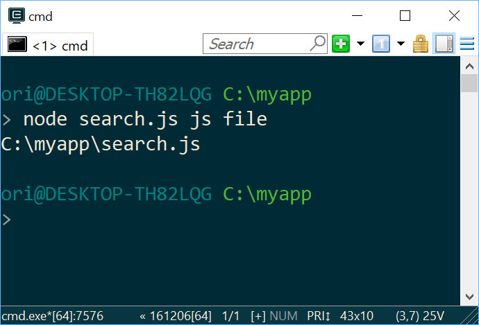

The application searches for all files that contains a specified string under the current directory.

For example, when the user executes the following command:
C:\MyFolder> node search.js txt Ori

The application searches for all files with the extension txt under C:\MyFolder (including subdirectories) that contain the string Ori. Once the search completes, the application displays the list of all matching files (full path)

Example 1: Running application without any parameter prints a simple help message

Example 2: Looking for all files with “txt” extension that contain the word “ori”

Example 3: Looking for all files with “js” extension that contain the word “file”

